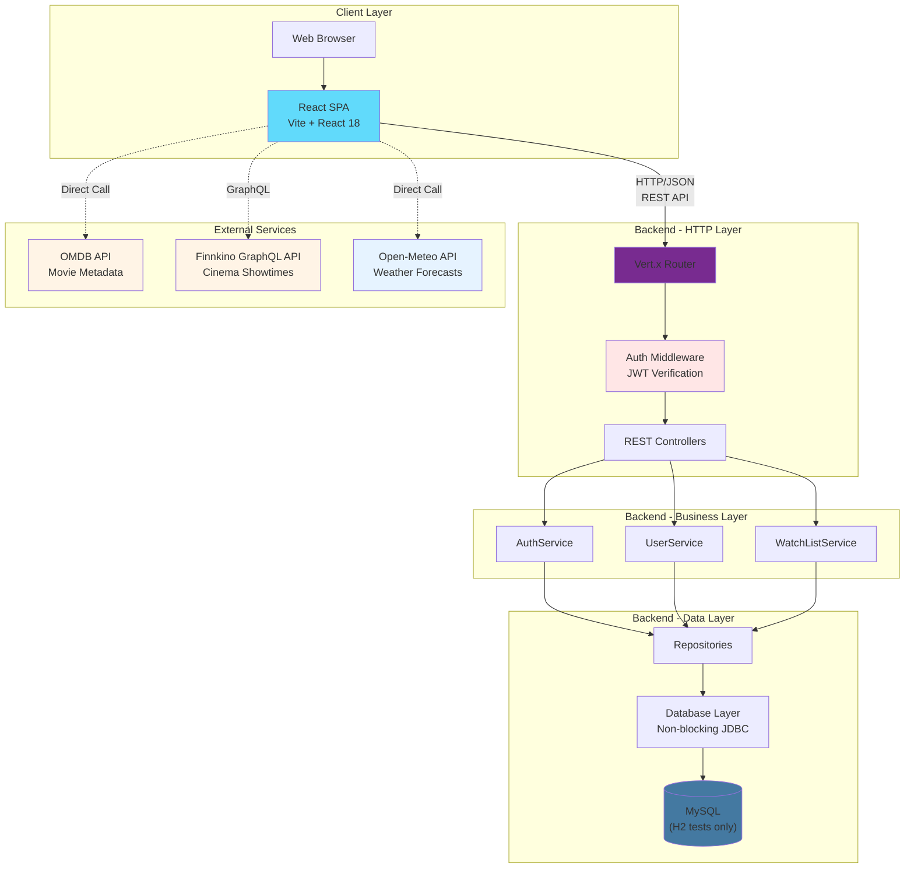
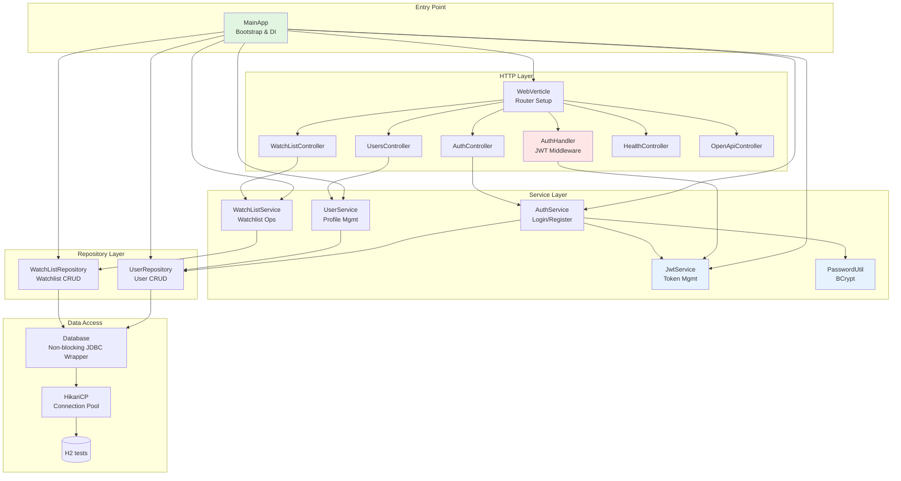
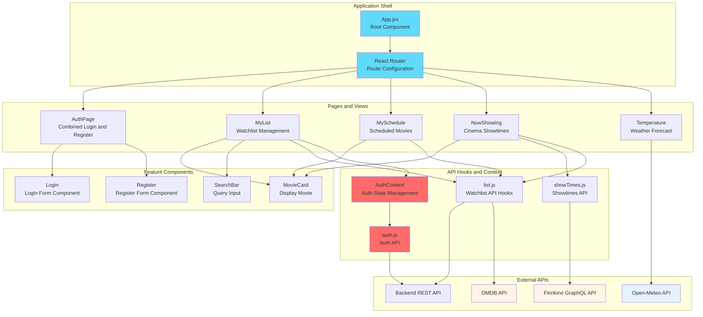
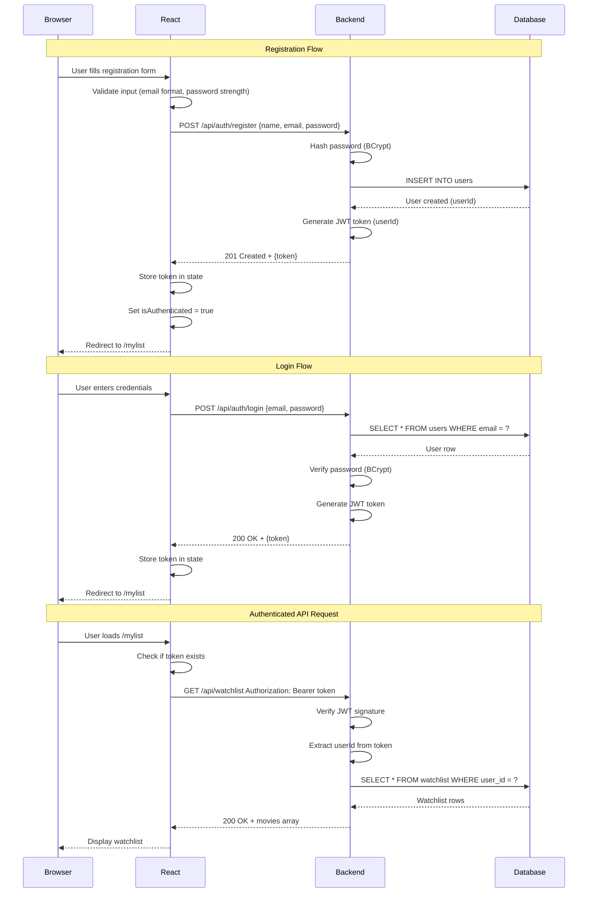
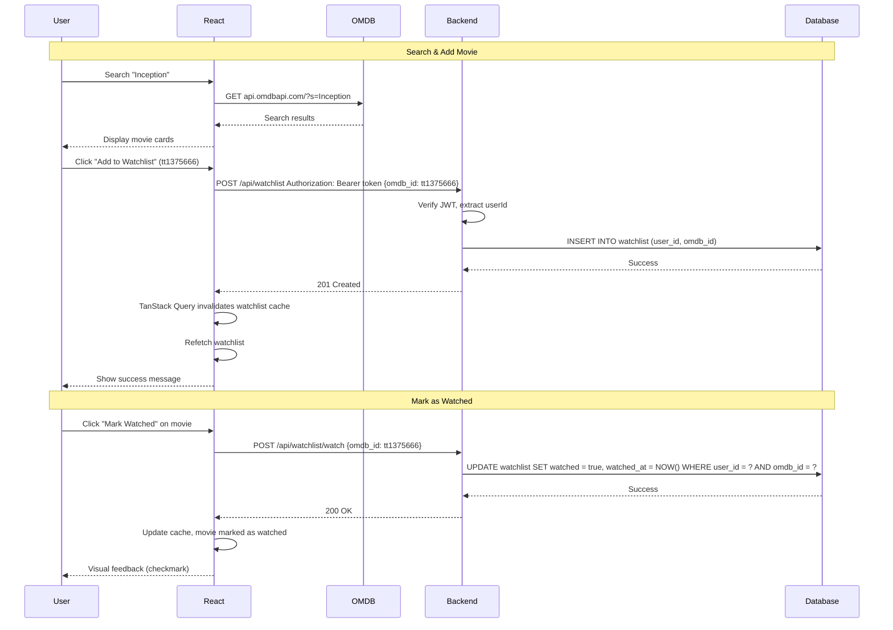
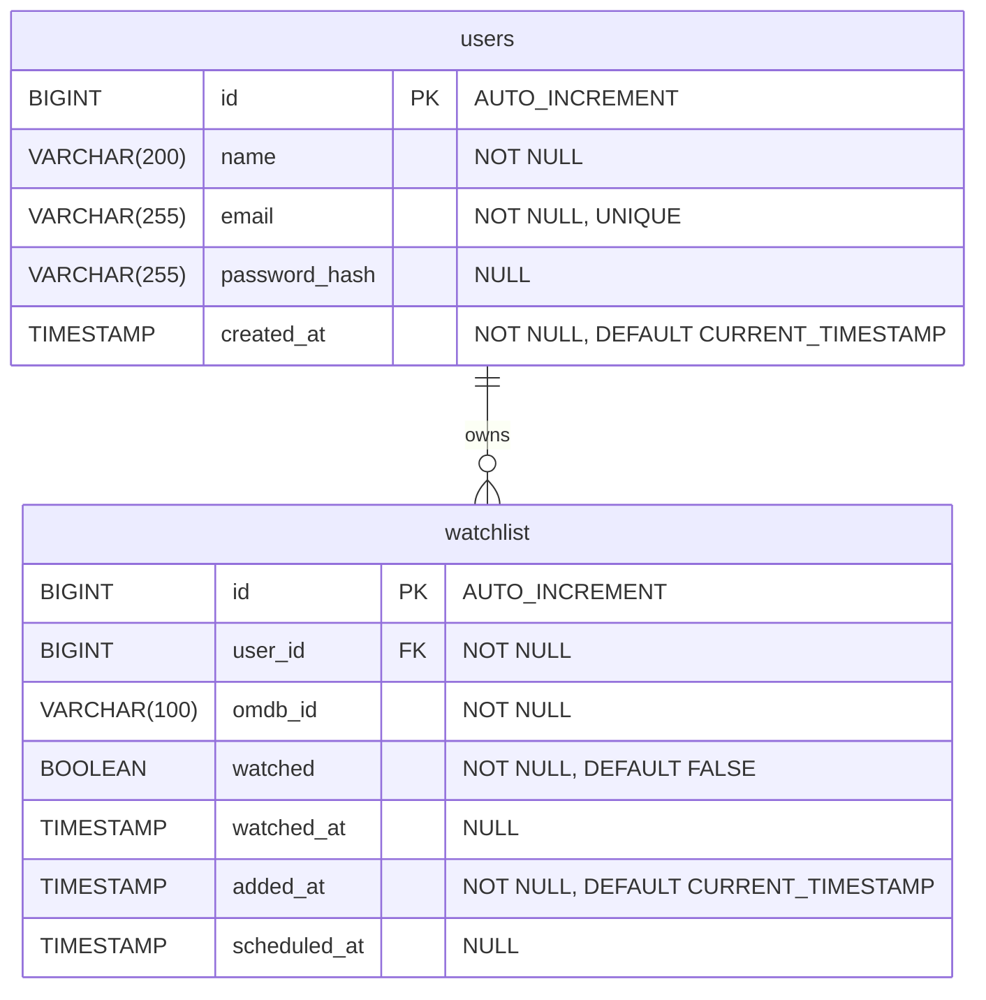
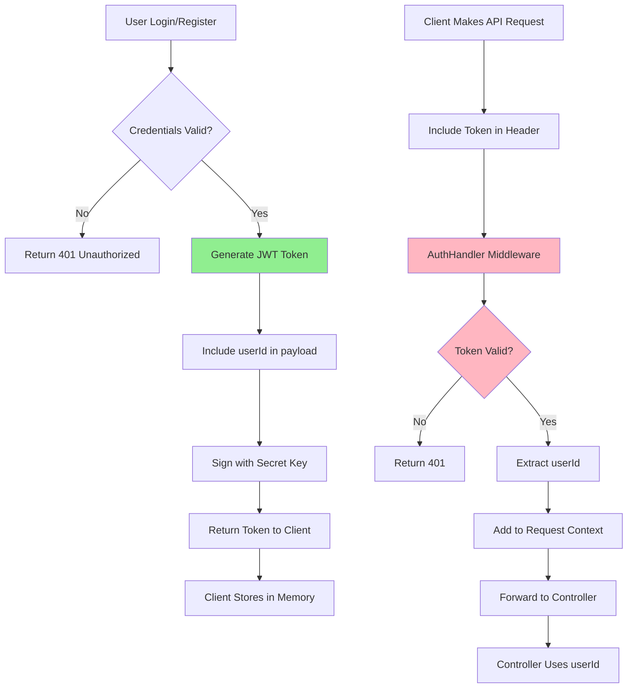

# CineSchedule - Full-Stack Design Document

**Project Name:** CineSchedule  
**Team:** Java null pointer exception  
**Version:** 2.0  
**Date:** December 2, 2025  
**Status:** Implementation Complete

---

## Executive Summary

CineSchedule is a full-stack web application that helps users discover movies, manage their personal watchlist, view cinema showtimes, and plan viewing based on weather conditions. The application integrates movie metadata from OMDB, cinema showtimes from Finnkino (via GraphQL scraper API), and weather forecasts from Open-Meteo.

The system is built with a **React 18 + Vite frontend** communicating with a **Java 17 + Vert.x backend**, featuring JWT authentication, RESTful APIs, and integration with multiple external services.

**Key Features:**

- 🔍 Movie search and discovery via OMDB API
- 📋 Personal watchlist management with add/remove/mark watched
- 🎬 Cinema showtimes integration with Finnkino theaters (via GraphQL API)
- 🌦️ 7-day weather forecast with intelligent movie-day recommendations
- 📅 Movie scheduling for planned viewings
- 📊 Visual analytics: ratings comparison charts and watch timeline
- 🔐 Secure JWT authentication with BCrypt password hashing

---

## Table of Contents

1. [Project Vision & User Stories](#1-project-vision--user-stories)
2. [System Architecture Overview](#2-system-architecture-overview)
3. [Technology Stack & Rationale](#3-technology-stack--rationale)
4. [Backend Design](#4-backend-design)
5. [Frontend Design](#5-frontend-design)
6. [Full-Stack Integration](#6-full-stack-integration)
7. [Data Models & API Contracts](#7-data-models--api-contracts)
8. [Security & Authentication](#8-security--authentication)
9. [Design Decisions & Rationale](#9-design-decisions--rationale)
10. [Self-Evaluation](#10-self-evaluation)

---

## 1. Project Vision & User Stories

### 1.1 Vision

CineSchedule simplifies the movie-watching experience by providing users with:

- **Movie Discovery:** Search and explore movies with detailed information from OMDB
- **Personal Organization:** Maintain a watchlist and track watched movies with visual analytics
- **Cinema Planning:** View current cinema showtimes from Finnkino theaters, grouped by date and venue
- **Weather-Aware Scheduling:** Check 7-day weather forecasts with smart recommendations for optimal movie-watching days
- **Data Visualization:** Compare ratings across IMDB/Rotten Tomatoes/Metacritic and view watch history timelines

### 1.2 Primary User Stories

| ID  | User Story                                                                                               | Priority | Status  |
| --- | -------------------------------------------------------------------------------------------------------- | -------- | ------- |
| 1   | As a user, I can **search for movies by title** and view details (plot, cast, poster, ratings) from OMDB | High     | ✅ Done |
| 2   | As a user, I can **add movies to my watchlist** and see them when I return to the app                    | High     | ✅ Done |
| 3   | As a user, I can **mark movies as watched** to track what I've seen                                      | High     | ✅ Done |
| 4   | As a user, I can **remove movies from my watchlist** when I'm no longer interested                       | High     | ✅ Done |
| 5   | As a user, I can **view cinema showtimes** to plan cinema visits                                         | High     | ✅ Done |
| 6   | As a user, I can **register and login** to access my personal watchlist                                  | High     | ✅ Done |
| 7   | As a user, I can **view weather forecasts** to plan optimal viewing times                                | Medium   | ✅ Done |
| 8   | As a user, I can **schedule a movie viewing** for a specific date and time                               | Medium   | ✅ Done |
| 9   | As a user, I can **view ratings comparison charts** for movies in my watchlist                           | Medium   | ✅ Done |
| 10  | As a user, I can **view my watch history timeline** with filtering options                               | Medium   | ✅ Done |

### 1.3 Out of Scope (Dropped Features)

- ❌ Personal movie ratings (0-10 scale)
- ❌ Personal notes for movies
- ❌ Social features (sharing, following users)
- ❌ Movie recommendations based on preferences

---

## 2. System Architecture Overview

### 2.1 High-Level Architecture



### 2.2 Architectural Patterns

**Backend Architecture:**

- **Layered Architecture:** HTTP → Service → Repository → Database
- **Manual Dependency Injection:** Explicit wiring in MainApp for clarity
- **Repository Pattern:** Abstract data access from business logic
- **Event-Driven I/O:** Vert.x non-blocking event loop for high concurrency

**Frontend Architecture:**

- **Component-Based:** React functional components with hooks
- **Server-State Management:** TanStack Query for API data fetching and caching
- **Client-State Management:** React hooks (useState, useContext) for UI state
- **Declarative Routing:** React Router for navigation

**Integration Strategy:**

- **RESTful API:** JSON over HTTP/HTTPS
- **JWT Authentication:** Stateless tokens in Authorization headers
- **Phased External API Integration:**
  - Phase 1: Frontend calls OMDB directly
  - Phase 2: Backend proxies and caches OMDB responses

---

## 3. Technology Stack & Rationale

### 3.1 Technology Choices

| Layer                  | Technology         | Version | Rationale                                                    |
| ---------------------- | ------------------ | ------- | ------------------------------------------------------------ |
| **Frontend Framework** | React              | 18.x    | Team experience with React                                   |
| **Build Tool**         | Vite               | 5.x     | Fast development, good React support                         |
| **Routing**            | React Router       | 6.x     | Standard routing solution for React                          |
| **Data Fetching**      | TanStack Query     | 5.x     | Team experience, simpler than Redux                          |
| **Styling**            | Tailwind CSS       | 3.x     | Team experience, rapid development                           |
| **Charts**             | Chart.js           | 4.x     | Simple API for weather visualization                         |
| **Backend Language**   | Java               | 17      | Assignment requirement                                       |
| **Backend Framework**  | Vert.x             | 4.x     | Non-blocking I/O, handles high concurrency                   |
| **Database**           | MySQL (+ H2 tests) | 8.x/2.x | MySQL at runtime; H2 only for automated tests/prototyping    |
| **Schema Migrations**  | Flyway             | 9.x     | Version control for database, automatic migration on startup |
| **Connection Pooling** | HikariCP           | 5.x     | Industry-leading JDBC connection pool performance            |
| **Authentication**     | JWT                | -       | Stateless, scalable, industry-standard                       |
| **Password Hashing**   | BCrypt             | -       | Secure, salted, adaptive cost factor                         |

### 3.2 Key Technology Decisions

#### Why Java?

- **Assignment Requirement:** Java was required for the backend implementation
- **Team Experience:** Team members had prior experience with Java

#### Why React + Vite?

- **Team Experience:** Multiple team members had experience with React
- **Fast Development:** Vite provides quick feedback during development
- **Modern Tooling:** Good ecosystem support

#### Why TanStack Query?

- **Team Experience:** Team members familiar with this approach
- **Simpler:** Less boilerplate than Redux for our use case
- **Built-in Features:** Automatic caching and loading states

#### Why Vert.x?

- **Performance:** Non-blocking I/O ideal for external API calls
- **Simplicity:** Explicit dependency management, easier to understand

#### Why MySQL (+ H2 only for tests)?

- **Team Experience:** Team familiar with MySQL
- **Testing:** H2 only used in-memory for automated tests; runtime environments target MySQL

---

## 4. Backend Design

### 4.1 Backend Layer Architecture



### 4.2 Key Backend Components

| Component               | Responsibility                                             | Key Methods                                                                                   |
| ----------------------- | ---------------------------------------------------------- | --------------------------------------------------------------------------------------------- |
| **MainApp**             | Bootstrap application, manual DI, Flyway migrations        | `main()`, `createDataSource()`                                                                |
| **WebVerticle**         | Setup HTTP router, mount controllers, configure middleware | `start()`                                                                                     |
| **AuthHandler**         | JWT verification middleware, extract user ID               | `handle()`                                                                                    |
| **AuthController**      | Handle login/register endpoints                            | `POST /api/auth/login`, `POST /api/auth/register`                                             |
| **UsersController**     | User profile management                                    | `GET /api/users/:id`, `GET /api/users`                                                        |
| **WatchListController** | Watchlist CRUD operations                                  | `GET/POST/DELETE /api/watchlist`, `POST /api/watchlist/schedule`, `POST /api/watchlist/watch` |
| **HealthController**    | Health check endpoint                                      | `GET /health`, `GET /api/ping`                                                                |
| **OpenApiController**   | OpenAPI specification endpoint                             | `GET /api/openapi`                                                                            |
| **AuthService**         | Authentication business logic                              | `register()`, `login()`                                                                       |
| **UserService**         | User management logic                                      | `getUserById()`, `updateUser()`                                                               |
| **WatchListService**    | Watchlist business logic                                   | `add()`, `list()`, `markWatched()`, `remove()`, `schedule()`                                  |
| **JwtService**          | JWT token generation/verification                          | `generateToken()`, `verify()`                                                                 |
| **PasswordUtil**        | BCrypt password hashing                                    | `hash()`, `verify()`                                                                          |
| **UserRepository**      | User data persistence                                      | `createUser()`, `getUserByEmail()`, `getUserById()`                                           |
| **WatchListRepository** | Watchlist data persistence                                 | `add()`, `list()`, `markWatched()`, `remove()`, `schedule()`                                  |
| **Database**            | Non-blocking JDBC wrapper                                  | `query()`, `executeUpdate()`, `insert()`                                                      |

### 4.3 SOLID Principles in the Backend

- **Single Responsibility:** Controllers only translate HTTP to service calls, services house business rules, repositories encapsulate DB access, and utility classes (e.g., `PasswordHasher`, `TokenService`) focus on a single concern.
- **Open/Closed:** Swappable abstractions (`UserRepository`, `WatchListRepository`, `TokenService`, `PasswordHasher`) allow new implementations (e.g., different DB or token provider) without changing callers.
- **Liskov Substitution:** Interfaces are designed so any implementation (e.g., `JdbcUserRepository` or an in-memory fake in tests) can be dropped in without altering behavior or contracts.
- **Interface Segregation:** Narrow interfaces expose only what each layer needs; controllers depend on services, not repositories, and auth depends on token/password contracts rather than broader utility classes.
- **Dependency Inversion:** High-level modules depend on interfaces; wiring happens in `MainApp`, which provides concrete `Default*Service` and `Jdbc*Repository` implementations alongside `TokenService`/`PasswordHasher`.

### 4.4 MVC Mapping

- **Model:** Domain objects (`User`, `Movie`, `WatchList`) plus business logic in services (`DefaultAuthService`, `DefaultUserService`, `DefaultWatchListService`) and persistence via repositories.
- **View:** JSON responses produced by controllers and Vert.x routing (no server-side templates; API-first surface).
- **Controller:** Vert.x controllers (`AuthController`, `UsersController`, `WatchListController`, `HealthController`) handle routing, request parsing, validation, and delegate to services.
- **Flow:** HTTP request → Router/`AuthHandler` (JWT guard) → Controller → Service → Repository → Database, then back through service and controller to a JSON response.
How Our Backend Implements MVC Architecture

#### Model Layer

**Responsibility:** Represent domain objects and their structure

**Components:**

```
// User.java - Domain model

public  class  User {

private  Long  id;

private  String  name;

private  String  email;

private  String  passwordHash; // Never exposed in API responses

private  Instant  createdAt;

// Getters, setters, constructors

}


// Movie.java - Watchlist entry domain model

public  class  Movie {

private  Long  id;

private  String  omdbId;

private  boolean  watched;

private  Instant  watchedAt;

// Getters, setters, constructors

}
```

**Characteristics:**

- Pure data objects (POJOs)
- No business logic
- No HTTP knowledge
- Can be serialized to JSON
- Reusable across layers

#### Controller Layer

**Responsibility:** Handle HTTP requests, delegate to services, return responses

**Components:**

```
// AuthController.java
public class AuthController {
    private AuthService authService;

    public void register(RoutingContext context) {
        // 1. Parse HTTP request body
        JsonObject body = context.body().asJsonObject();

        // 2. Delegate to service
        authService.register(name, email, password)
            .onSuccess(token -> {
                // 3. Return HTTP response (View)
                context.response()
                    .setStatusCode(201)
                    .putHeader("content-type", "application/json")
                    .end(new JsonObject().put("token", token).encode());
            })
            .onFailure(error -> {
                // 4. Return error response
                context.response()
                    .setStatusCode(400)
                    .end(new JsonObject().put("error", error.getMessage()).encode());
            });
    }

    public void login(RoutingContext context) {
        // Similar pattern...
    }
}
```

**Characteristics:**

- Receives HTTP requests
- Validates HTTP-level concerns (headers, content-type)
- Delegates business logic to services
- Returns HTTP responses
- Thin layer - minimal logic

#### Service/Business Logic Layer

**Responsibility:** Implement business logic independent of HTTP

**Components:**

```
// AuthService.java
public class AuthService {
    private UserRepository userRepository;
    private JwtService jwtService;
    private PasswordUtil passwordUtil;

    public Future<String> register(String name, String email, String password) {
        // 1. Business logic: validate input
        if (!isValidEmail(email)) {
            return Future.failedFuture("Invalid email");
        }

        // 2. Business logic: check email uniqueness
        return userRepository.getUserByEmail(email)
            .compose(existing -> {
                if (existing != null) {
                    return Future.failedFuture("Email already registered");
                }

                // 3. Business logic: hash password
                String hashedPassword = passwordUtil.hash(password);

                // 4. Persist user
                return userRepository.createUser(name, email, hashedPassword);
            })
            .compose(user -> {
                // 5. Generate token
                String token = jwtService.generateToken(user.getId());
                return Future.succeededFuture(token);
            });
    }
}
```

**Characteristics:**

- No HTTP knowledge
- Implements domain rules
- Orchestrates repository operations
- Uses dependency injection
- Returns Future for async operations

#### Data Access/Repository Layer

**Responsibility:** Abstract database access

**Components:**

```
// UserRepository.java
public class UserRepository {
    private DataSource dataSource;

    public Future<User> getUserByEmail(String email) {
        return database.query(
            "SELECT * FROM users WHERE email = ?",
            email
        ).map(row -> new User(
            row.getLong("id"),
            row.getString("name"),
            row.getString("email"),
            row.getString("password_hash"),
            row.getTimestamp("created_at").toInstant()
        ));
    }

    public Future<User> createUser(String name, String email, String passwordHash) {
        return database.executeUpdate(
            "INSERT INTO users (name, email, password_hash) VALUES (?, ?, ?)",
            name, email, passwordHash
        ).compose(id -> getUserById(id));
    }
}
```

**Characteristics:**

- Encapsulates database logic
- Returns domain objects
- Uses parameterized queries (security)
- No business logic
- Can be tested with in-memory database

#### View Layer

- Frontend React SPA

**Responsibility:** Displays data, captures user input, sends to backend

**Characteristics:**

- In charge of Data Presentation
- Handles user interaction and sends actions to the controller
- Data Fetching via REST API
- Decoupled from Backend Logic
- Responsive

### 4.5 API Endpoints

#### Public Endpoints (No Authentication)

| Method | Endpoint             | Description       | Request Body              | Response               |
| ------ | -------------------- | ----------------- | ------------------------- | ---------------------- |
| POST   | `/api/auth/register` | Register new user | `{name, email, password}` | `201 + {token, user}`  |
| POST   | `/api/auth/login`    | Authenticate user | `{email, password}`       | `200 + JWT token`      |
| GET    | `/health`            | Health check      | -                         | `{status: "ok", time}` |
| GET    | `/api/ping`          | Simple ping       | -                         | `"pong"`               |
| GET    | `/api/openapi`       | OpenAPI spec      | -                         | OpenAPI JSON           |

#### Protected Endpoints (JWT Required)

| Method | Endpoint                      | Description                 | Request Body              | Response                   |
| ------ | ----------------------------- | --------------------------- | ------------------------- | -------------------------- |
| GET    | `/api/watchlist`              | Get user's watchlist        | -                         | Array of movies            |
| POST   | `/api/watchlist`              | Add movie to watchlist      | `{omdb_id}`               | `201 + {id}`               |
| POST   | `/api/watchlist/schedule`     | Schedule a movie            | `{omdb_id, scheduled_at}` | `201 + {id, scheduled_at}` |
| POST   | `/api/watchlist/watch`        | Mark movie as watched       | `{omdb_id}`               | `200 + {updated}`          |
| DELETE | `/api/watchlist?omdb_id=<id>` | Remove movie from watchlist | -                         | `200 + {deleted}`          |
| GET    | `/api/users/:id`              | Get user profile            | -                         | User object                |
| GET    | `/api/users`                  | Get all users               | -                         | Array of users             |

---

## 5. Frontend Design

### 5.1 Frontend Architecture



### 5.2 Frontend Structure

```
frontend/cineschedule/
├── public/
│   └── (static assets)
├── src/
│   ├── main.jsx                 # Entry point with React Query & Auth providers
│   ├── App.jsx                  # Root component with router
│   ├── App.css                  # Global styles
│   ├── index.css                # Tailwind imports
│   ├── dbMock.js                # Mock database for development
│   ├── api/                     # API integration layer
│   │   ├── auth.js              # Authentication API calls
│   │   ├── list.js              # Watchlist API hooks (TanStack Query)
│   │   ├── omdbMock.js          # Mock OMDB data for testing
│   │   ├── showTimes.js         # Cinema showtimes API
│   │   └── showTimesMock.json   # Mock showtime data
│   ├── components/              # Reusable React components
│   │   ├── MovieCard.jsx        # Movie display card with actions
│   │   └── SearchBar.jsx        # Movie search input component
│   ├── context/                 # React Context for global state
│   │   └── AuthContext.jsx      # Authentication state provider
│   ├── hooks/                   # Custom React hooks
│   │   └── useSchedule.jsx      # Schedule/movie planning hook
│   ├── routes/                  # Page components
│   │   ├── AuthPage.jsx         # Auth page wrapper (login/register toggle)
│   │   ├── Login.jsx            # Login form component
│   │   ├── Register.jsx         # Registration form component
│   │   ├── MyList.jsx           # User watchlist page
│   │   ├── MySchedule.jsx       # User's scheduled viewings
│   │   ├── NowShowing.jsx       # Current cinema showtimes
│   │   └── Temperature.jsx      # Weather forecast page
│   ├── utils/                   # Utility functions
│   │   └── fetchWithAuth.js     # HTTP client with auth headers
│   └── assets/                  # Static assets (images, icons, etc.)
├── .env.example                 # Environment variables template
├── .dockerignore                # Docker ignore patterns
├── Dockerfile                   # Docker configuration
├── index.html                   # Main HTML file
├── vite.config.js               # Vite configuration
├── tailwind.config.cjs          # Tailwind CSS configuration
├── postcss.config.cjs           # PostCSS configuration
├── eslint.config.js             # ESLint configuration
└── package.json                 # Dependencies and scripts
```

### 5.3 Key Frontend Components

#### 5.3.1 Pages

| Page            | Route          | Description             | Key Features                                                                                     |
| --------------- | -------------- | ----------------------- | ------------------------------------------------------------------------------------------------ |
| **AuthPage**    | `/auth`        | Combined login/register | Toggle between login and register, form validation, JWT token storage, auto-redirect on success  |
| **MyList**      | `/mylist`      | User's watchlist        | Search movies via OMDB, display watchlist, add/delete/mark watched, ratings comparison charts    |
| **MySchedule**  | `/myschedule`  | Scheduled viewings      | Display scheduled movies, plan viewing dates, mark as watched, watch history timeline            |
| **NowShowing**  | `/nowshowing`  | Cinema showtimes        | Display Finnkino showtimes grouped by date/theater, movie posters from OMDB, clickable buy links |
| **Temperature** | `/temperature` | Weather forecast        | 7-day forecast from Open-Meteo, smart movie-day recommendations based on weather conditions      |

### 5.4 Routing Configuration

```javascript
// App.jsx - Route configuration
<Routes>
	<Route path="/" element={<Navigate to="/mylist" />} />
	<Route path="/auth" element={<Auth />} />
	<Route
		path="/mylist"
		element={
			<ProtectedRoute>
				<MyList />
			</ProtectedRoute>
		}
	/>
	<Route
		path="/myschedule"
		element={
			<ProtectedRoute>
				<MySchedule />
			</ProtectedRoute>
		}
	/>
	<Route
		path="/temperature"
		element={
			<ProtectedRoute>
				<Temperature />
			</ProtectedRoute>
		}
	/>
	<Route
		path="/nowshowing"
		element={
			<ProtectedRoute>
				<NowShowing />
			</ProtectedRoute>
		}
	/>
</Routes>
```

**Authentication Guard Strategy:**

- `/auth` route is public for login/register
- All other routes use `<ProtectedRoute>` wrapper component
- `AuthContext` provides authentication state via `useAuth` hook
- Protected pages check auth status and redirect to `/auth` if not authenticated
- Simple pattern: Check auth in page component, redirect if needed

### 5.5 State Management Strategy

**Server State (TanStack Query):**

- User data (profile, watchlist)
- Movie data (search results, details)
- Showtimes data
- Weather data
- Automatic caching, refetching, and cache invalidation

**Client State (React Hooks):**

- UI state (modals, dropdowns, form inputs)
- Navigation state
- Theme/preferences (if implemented)
- Uses `useState`, `useReducer`, `useContext` as needed

**Authentication State:**

- JWT token stored in React state and persisted to `sessionStorage` for reload survival
- Token sent in `Authorization: Bearer <token>` header
- `AuthContext`/`useAuth` provides centralized auth state and logout handling

---

## 6. Full-Stack Integration

### 6.1 Authentication Flow



### 6.2 Watchlist Management Flow



### 6.3 Data Flow Patterns

#### Pattern 1: Simple Backend API Call

```javascript
// Frontend: api/list.js
export function useGetMyList() {
	return useQuery({
		queryKey: ["watchlist"],
		queryFn: async () => {
			const response = await fetch(`${API_URL}/api/watchlist`, {
				headers: {
					Authorization: `Bearer ${getToken()}`,
				},
			});
			if (!response.ok) throw new Error("Failed to fetch watchlist");
			return response.json();
		},
	});
}
```

#### Pattern 2: Direct External API (OMDB)

```javascript
// Frontend: api/list.js
export function useSearch(searchTerm) {
	return useQuery({
		queryKey: ["movies", "search", searchTerm],
		queryFn: async () => {
			const response = await fetch(
				`http://www.omdbapi.com/?apikey=${OMDB_API_KEY}&s=${searchTerm}`
			);
			const data = await response.json();
			return data.Search || [];
		},
		enabled: searchTerm.length > 2,
	});
}
```

#### Pattern 3: GraphQL External API (Finnkino Showtimes)

```javascript
// Frontend: api/showTimes.js
export function fetchShowtimes() {
	return useQuery({
		queryKey: ["showtimes"],
		queryFn: async () => {
			const response = await fetch(
				"https://api.jeanbaptistevanparys.be/graphql",
				{
					method: "POST",
					headers: { "Content-Type": "application/json" },
					body: JSON.stringify({
						query: `{
						moviesWithShowtimes {
							title
							imdbUrl
							showtimesByMovieId {
								showDatetime
								theatreName
								buyUrl
							}
						}
					}`,
					}),
				}
			);
			return response.json();
		},
		staleTime: 1000 * 60 * 30, // Cache for 30 minutes
	});
}
```

#### Pattern 4: Direct Weather API (Open-Meteo)

```javascript
// Frontend: routes/Temperature.jsx (inline)
const { data } = useQuery({
	queryKey: ["weather-tampere"],
	queryFn: async () => {
		const response = await fetch(
			`https://api.open-meteo.com/v1/forecast?latitude=61.4978&longitude=23.761&daily=weathercode,temperature_2m_max,temperature_2m_min,precipitation_probability_max&timezone=Europe/Helsinki&forecast_days=7`
		);
		return await response.json();
	},
	staleTime: 1000 * 60 * 30, // Cache for 30 minutes
});
```

### 6.4 Error Handling Strategy

**Frontend Error Handling:**

- TanStack Query provides `error` state automatically
- Display user-friendly error messages
- Retry failed requests with exponential backoff
- Show loading states during API calls

**Backend Error Responses:**

- Consistent error format: `{error: "message"}`
- Appropriate HTTP status codes:
  - 400 Bad Request (invalid input)
  - 401 Unauthorized (missing/invalid token)
  - 404 Not Found (resource doesn't exist)
  - 500 Internal Server Error (unexpected errors)

---

## 7. Data Models & API Contracts

### 7.1 Database Schema



### 7.2 Domain Models

#### User Model

```java
// Backend
public class User {
    private Long id;
    private String name;
    private String email;
    private String passwordHash; // Never exposed in API
    private Instant createdAt;
}
```

```javascript
// Frontend TypeScript interface
interface User {
	id: number;
	name: string;
	email: string;
	createdAt: string;
}
```

#### Movie Model (Watchlist Entry)

```java
// Backend
public class Movie {
    private Long id;           // DB identifier
    private String omdbId;     // OMDB/IMDB ID (e.g., "tt1375666")
    private boolean watched;   // Watched status
    private Instant watchedAt; // When marked as watched
}
```

```javascript
// Frontend
interface WatchlistMovie {
	id: number;
	omdb_id: string;
	watched: boolean;
	watched_at?: string;
	// These fields come from OMDB API (enriched client-side):
	title?: string;
	year?: string;
	poster?: string;
	plot?: string;
}
```

#### OMDB API Response (External)

```javascript
// OMDB Search Result
interface OMDBSearchResult {
	imdbID: string; // e.g., "tt1375666"
	Title: string;
	Year: string;
	Type: string; // "movie", "series", "episode"
	Poster: string; // URL
}

// OMDB Movie Detail
interface OMDBMovie {
	imdbID: string;
	Title: string;
	Year: string;
	Rated: string;
	Released: string;
	Runtime: string;
	Genre: string;
	Director: string;
	Writer: string;
	Actors: string;
	Plot: string;
	Poster: string;
	imdbRating: string;
	// ... many more fields
}
```

### 7.3 API Request/Response Examples

#### Authentication

```bash
# Register
POST /api/auth/register
Content-Type: application/json

{
  "name": "John Doe",
  "email": "john@example.com",
  "password": "securePassword123"
}

# Response
201 Created
{
  "token": "eyJhbGciOiJIUzI1NiIsInR5cCI6IkpXVCJ9..."
}
```

#### Watchlist Operations

```bash
# Get Watchlist
GET /api/watchlist
Authorization: Bearer <token>

# Response
200 OK
[
  {
    "id": 1,
    "omdb_id": "tt1375666",
    "watched": false,
    "watched_at": null
  },
  {
    "id": 2,
    "omdb_id": "tt0816692",
    "watched": true,
    "watched_at": "2025-11-15T10:30:00Z"
  }
]

# Add Movie
POST /api/watchlist
Authorization: Bearer <token>
Content-Type: application/json

{
  "omdb_id": "tt0468569"
}

# Response
201 Created
{
  "id": 3
}

# Mark as Watched
POST /api/watchlist/watch
Authorization: Bearer <token>
Content-Type: application/json

{
  "omdb_id": "tt0468569"
}

# Response
200 OK
{
  "updated": 1
}
```

---

## 8. Security & Authentication

### 8.1 Authentication Architecture



### 8.2 Security Measures

#### Password Security

- **BCrypt Hashing:** All passwords hashed with automatically generated salts
- **Adaptive Cost:** BCrypt cost factor can be increased as hardware improves
- **No Plaintext:** Passwords never logged or stored in plaintext
- **Timing-Safe Comparison:** Prevents timing attacks during verification

#### JWT Token Security

- **Signing Algorithm:** HMAC-SHA256 (HS256)
- **Secret Key:** Strong random secret (256+ bits)
- **Token Expiration:** 60 minutes (configurable via `jwt.exp.minutes`)
- **Stateless:** No server-side session storage required
- **Token Storage:** Frontend stores tokens in sessionStorage for persistence across page refreshes

#### API Security

- **SQL Injection Prevention:** Parameterized queries (JDBC PreparedStatements)
- **CORS Configuration:** Restricted origins in production
- **Rate Limiting:** Planned for external API calls
- **Input Validation:** All user inputs validated before processing
- **Cross-User Access Prevention:** All endpoints verify resource ownership

#### Network Security

- **HTTPS Required:** Production deployment uses TLS/SSL
- **Secure Headers:** Planned (HSTS, X-Frame-Options, CSP)
- **Token Storage:** Tokens kept in client state with sessionStorage persistence; rotate/clear on logout

### 8.3 Authorization Flow

1. **Token Generation (Login/Register):**

   - User provides credentials
   - Backend verifies (register: create user, login: check password)
   - Backend generates JWT with `userId` in payload
   - Token returned to client

2. **Token Verification (Protected Endpoints):**

   - Client includes token in `Authorization: Bearer <token>` header
   - AuthHandler middleware intercepts request
   - JwtService verifies token signature and expiration
   - If valid, `userId` extracted and added to routing context
   - Controller accesses `userId` from context

3. **Resource Ownership Check:**
   - Controllers verify user owns the resource being accessed
   - Example: WatchlistController ensures watchlist entry belongs to authenticated user
   - Prevents unauthorized access to other users' data

---

## 9. Design Decisions & Rationale

### 9.1 Technology Choices

#### Java Backend

**Decision:** Use Java 17 for backend development

**Rationale:**

- **Assignment Requirement:** Java was required for the course assignment
- **Team Experience:** Team members had prior experience with Java

#### React Frontend

**Decision:** Use React 18 with Vite for frontend

**Rationale:**

- **Team Experience:** Multiple team members familiar with React
- **Fast Development:** Vite provides quick development feedback
- **Modern Tooling:** Good ecosystem and community support

#### MySQL Database

**Decision:** Use MySQL for production; H2 only for automated tests/local prototyping

**Rationale:**

- **Team Experience:** Team familiar with MySQL
- **Testing:** H2 is used only in-memory for automated tests/prototyping; runtime targets MySQL
- **Compatibility:** H2 supports MySQL mode for consistent SQL during tests

### 9.2 Architecture Decisions

#### Layered Architecture

**Decision:** Separate HTTP, Service, Repository, and Database layers

**Rationale:**

- Clear separation of concerns
- Easier testing with isolated layers
- Team can work on different layers in parallel

#### Manual Dependency Injection

**Decision:** Wire dependencies manually in MainApp

**Rationale:**

- Explicit and visible dependency graph
- Simpler than Spring for project scope
- Easier to understand for team

#### Non-Blocking Database Access

**Decision:** Use Vert.x `executeBlocking()` for JDBC

**Rationale:**

- Prevents blocking the event loop
- Maintains Vert.x performance benefits
- Works with standard JDBC drivers

### 9.3 Frontend Decisions

#### TanStack Query

**Decision:** Use TanStack Query for server state

**Rationale:**

- **Team Experience:** Team members familiar with this approach
- **Simpler:** Less boilerplate than Redux
- **Built-in Features:** Automatic caching and loading states

#### Direct External API Integration

**Decision:** Frontend calls external APIs directly (OMDB, Finnkino GraphQL, Open-Meteo)

**Rationale:**

- Faster initial development - no backend proxy needed
- Reduced backend complexity
- TanStack Query provides client-side caching
- Works well for public APIs with reasonable rate limits
- Can add backend proxy later if needed (not critical)

#### JWT with sessionStorage

**Decision:** Store JWT tokens in sessionStorage for persistence

**Rationale:**

- Survives page refreshes without re-login
- Simpler user experience
- Trade-off: slightly less secure than memory-only, but acceptable for this use case
- Token expiration (60 min) limits exposure window

---

## 10. Self-Evaluation

### 10.1 How Well We Stuck to Original Design

**Overall Assessment:** We have largely followed the original architectural design.

**What Stayed the Same:**

- ✅ **Layered Architecture:** HTTP → Service → Repository → Database pattern maintained
- ✅ **Technology Stack:** Vert.x, Flyway, HikariCP, JWT authentication all used as planned
- ✅ **Manual DI:** Explicit dependency injection in MainApp as designed
- ✅ **Non-Blocking I/O:** Vert.x event loop with executeBlocking for JDBC
- ✅ **Security:** BCrypt password hashing, JWT tokens, prepared statements

**What Changed:**

- ✅ **External API Integration:** Successfully integrated all planned external services

  - OMDB API for movie metadata and posters
  - Finnkino GraphQL API for cinema showtimes (via scraper at api.jeanbaptistevanparys.be)
  - Open-Meteo API for weather forecasts
  - All integrated with direct frontend calls (no backend proxy needed)

- ✅ **Frontend Routing:** Simplified authentication flow

  - Combined login/register into single `/auth` route
  - Login.jsx and Register.jsx exist as components within AuthPage
  - Cleaner UX with toggle interface

- ✅ **Enhanced Features Beyond Original Scope:**

  - Ratings comparison charts (IMDB/Rotten Tomatoes/Metacritic)
  - Watch history timeline with filtering (week/month/year/all)
  - Smart weather-based movie recommendations
  - Clickable buy links for cinema tickets

- ⚠️ **Simplified Features:**

  - Dropped personal ratings (0-10 scale)
  - Dropped personal notes for movies
  - `PUT /api/users/:id` endpoint not implemented

### 10.2 Implementation Progress

**Successfully Implemented:**

- ✅ User registration and login (JWT authentication)
- ✅ User management with validation and ownership checks
- ✅ Watchlist CRUD operations (add, list, remove, mark watched)
- ✅ Movie scheduling with `scheduled_at` field
- ✅ Frontend fully delivered (React + Vite + TanStack Query + Tailwind CSS)
- ✅ OMDB integration (direct frontend calls with poster fetching)
- ✅ Finnkino cinema showtimes via GraphQL API
- ✅ Open-Meteo weather integration with 7-day forecasts
- ✅ Smart weather-based movie day recommendations
- ✅ Ratings comparison charts (visual analytics)
- ✅ Watch history timeline with time filtering
- ✅ Non-blocking database operations
- ✅ Flyway migrations for schema versioning
- ✅ MySQL for production, H2 for automated tests
- ✅ Health check and OpenAPI spec endpoints
- ✅ Comprehensive seed data for testing

**Not Implemented:**

- ❌ `PUT /api/users/:id` endpoint (user profile update)
- ❌ Backend proxy/caching for OMDB (Phase 2)
- ❌ ExternalController for API proxying

**Intentionally Dropped:**

- ❌ Personal movie ratings (0-10 scale)
- ❌ Personal notes for movies
- ❌ Social features (sharing, following users)
- ❌ Movie recommendations based on preferences

### 10.3 Design Quality Assessment

#### Maintainability

**Strong Points:**

- Clear separation of concerns across all layers
- Each component has single, well-defined responsibility
- Explicit dependency graph in MainApp
- No "magic" or hidden dependencies

**Evidence:**

- Adding new endpoints requires only creating controller + service
- Database schema changes isolated to migrations and repositories
- External service integration isolated to dedicated controllers

#### Testability

**Strong Points:**

- Layered architecture enables unit testing with mocks
- Services independent of HTTP layer
- Repositories can use in-memory H2 for integration tests; runtime uses MySQL

**Opportunities:**

- Need to add comprehensive test suite
- Plan for Testcontainers + WireMock for external API testing

#### Scalability

**Strong Points:**

- Vert.x non-blocking event-driven architecture handles high concurrency
- Stateless JWT authentication enables horizontal scaling
- No server-side sessions to synchronize across instances
- HikariCP connection pooling optimizes database access

**Evidence:**

- Single Vert.x instance can handle thousands of concurrent connections
- Can deploy multiple backend instances behind load balancer
- Frontend is static SPA, can be served from CDN

#### Reliability

**Strong Points:**

- Flyway migrations ensure database schema consistency
- HikariCP handles connection failures gracefully
- SQL injection prevented via prepared statements
- Graceful shutdown hooks ensure clean termination

**Opportunities:**

- Add retry logic for external API failures
- Implement circuit breaker pattern for external services
- Add more comprehensive error handling

### 10.4 Future Enhancements

#### 1. Backend OMDB Proxy (Optional)

**Potential Enhancement:** Add backend proxy for OMDB API

**Benefits:**

- Centralized caching with Redis or in-memory cache
- Rate limiting to avoid API quota issues
- Better error handling for unreliable external sources
- Could reduce API costs and improve response times

**Status:** Not critical - current direct frontend approach works well

#### 2. User Profile Management

**Missing Implementation:** `PUT /api/users/:id` endpoint

**Planned:**

- Allow users to update name and email
- Password change functionality
- Profile picture upload

#### 3. Enhanced Analytics

**Potential Features:**

- More detailed watch statistics
- Genre preferences analysis
- Viewing patterns and insights
- Export watch history

#### 4. Testing & Observability

**Improvements Needed:**

- Comprehensive unit tests for all services
- Integration tests for repositories
- End-to-end tests for critical user flows
- Structured logging (JSON format)
- Request timing metrics
- Enhanced health check with dependency status

### 10.5 Lessons Learned

**What Worked Well:**

1. **Layered Architecture:** Made development organized and enabled parallel work
2. **Manual DI:** Kept startup simple and dependencies explicit
3. **Flyway Migrations:** Eliminated database schema confusion
4. **Vert.x Performance:** Non-blocking I/O proved beneficial for external API calls
5. **Clear Component Boundaries:** Easy to add features without breaking existing code
6. **Direct External API Integration:** Frontend calls to OMDB/Finnkino/Open-Meteo worked efficiently
7. **TanStack Query:** Simplified state management and provided excellent caching
8. **Tailwind CSS:** Rapid UI development with consistent styling

**What We'd Do Differently:**

1. **Documentation Updates:** Should have kept design doc synchronized with implementation
2. **Test Coverage:** Should have written tests alongside implementation
3. **Incremental Features:** Some features (charts, timeline) were added without updating design doc
4. **API Endpoint Planning:** Should have clarified which endpoints would/wouldn't be implemented
5. **Component Organization:** Could have been more consistent with hook/API file organization

**Key Achievements:**

- Successfully integrated THREE external APIs (OMDB, Finnkino GraphQL, Open-Meteo)
- Delivered full-stack application with all core features
- Implemented features beyond original scope (charts, timeline, smart recommendations)
- Created working prototype with seed data for immediate testing
- Maintained clean architecture throughout rapid development

**Key Takeaway:**
The architectural foundation proved robust and flexible. The layered design allowed us to implement cinema showtimes and weather forecasts (originally "planned") without major refactoring. The direct frontend integration approach worked well and may not need backend proxying. Future work should focus on test coverage and implementing the missing user profile update endpoint.


---

## Appendix: Implementation Status Summary

### ✅ Completed Features

1. **Backend Core**

   - JWT authentication with BCrypt password hashing
   - User management (GET endpoints)
   - Watchlist CRUD operations
   - Movie scheduling
   - Health check and OpenAPI spec endpoints
   - Flyway database migrations
   - MySQL production database with H2 for tests

2. **Frontend Core**

   - React 18 + Vite + Tailwind CSS
   - TanStack Query for state management
   - AuthContext for authentication
   - Protected routing with ProtectedRoute wrapper
   - All major pages implemented

3. **External Integrations**

   - OMDB API for movie metadata and posters
   - Finnkino GraphQL API for cinema showtimes
   - Open-Meteo API for 7-day weather forecasts

4. **Advanced Features**
   - Ratings comparison charts (IMDB/RT/Metacritic)
   - Watch history timeline with filtering
   - Smart weather-based movie recommendations
   - Cinema showtime grouping by date/theater
   - Clickable ticket purchase links

### ❌ Not Implemented

1. **Backend Endpoints**

   - `PUT /api/users/:id` (user profile update)
   - Backend proxy for external APIs

2. **Testing**

   - Comprehensive unit test coverage
   - Integration tests
   - E2E tests

3. **Intentionally Dropped**
   - Personal movie ratings (0-10 scale)
   - Personal notes for movies
   - Social features
   - Movie recommendations engine

### 🔄 Potential Future Enhancements

1. **Performance Optimizations**

   - Backend caching layer for OMDB
   - Frontend code splitting
   - Image lazy loading
   - Service worker for offline support

2. **Enhanced User Experience**

   - User profile editing
   - Watchlist sorting and filtering
   - Search history
   - More detailed analytics

3. **Quality Improvements**
   - Comprehensive test suite
   - Structured logging
   - Request timing metrics
   - Enhanced error handling

---
